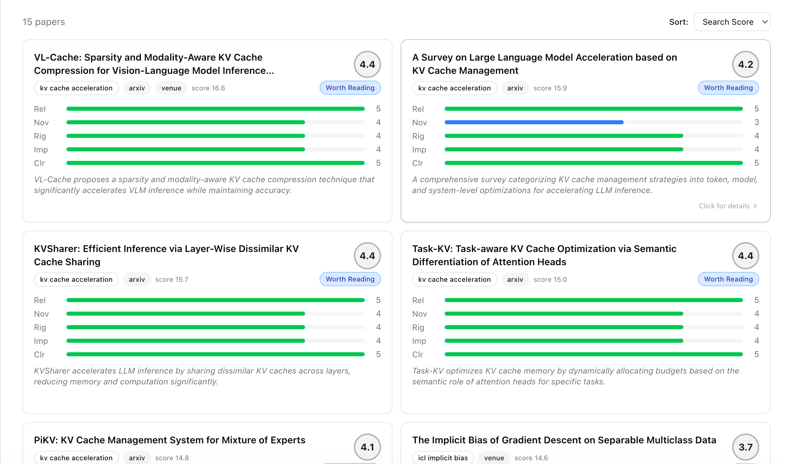

# PaperBot

论文检索、LLM 评审、学者追踪与 Paper2Code 的研究工作流工具链。

**后端** Python + FastAPI（SSE 流式） · **前端** Next.js Web + Ink CLI · **数据源** papers.cool / arXiv API / Semantic Scholar

## 核心功能

| 模块 | 说明 |
|------|------|
| **Topic Search** | 多主题聚合检索，支持 papers.cool + arXiv API 双数据源，跨 query/branch 去重与评分排序，`min_score` 质量过滤 |
| **DailyPaper** | 日报生成（Markdown/JSON），可选 LLM 增强（摘要/趋势/洞察/相关性），支持定时推送（Email/Slack/钉钉） |
| **LLM-as-Judge** | 5 维评分（Relevance/Novelty/Rigor/Impact/Clarity）+ 推荐分级，Token Budget 控制，SSE 流式推送 |
| **Analyze SSE** | Judge + Trend 分析通过 SSE 实时流式推送，前端增量渲染 |
| **学者追踪** | 定期监测学者论文，多 Agent 协作（Research/Code/Quality/Reviewer），PIS 影响力评分 |
| **深度评审** | 模拟同行评审（初筛→批评→决策），输出结构化评审报告 |
| **Paper2Code** | 论文到代码骨架生成（Planning→Analysis→Generation→Verification），支持 Docker/E2B 沙箱 |
| **个性化研究** | Research Track 管理、记忆 Inbox、Context Engine 路由与推荐 |

## 架构

> 完整架构图（可编辑）：[`asset/architecture.drawio`](asset/architecture.drawio)

```
┌─────────────────────────────────────────────────────────────────┐
│  Clients:  Web (Next.js)  ·  CLI (Ink)  ·  ARQ Cron  ·  Push  │
└────────────────────────────┬────────────────────────────────────┘
                             ▼
┌─────────────────── FastAPI Gateway (SSE) ───────────────────────┐
│  /search  /daily  /analyze  /track  /review  /gen-code  /chat  │
└────────────────────────────┬────────────────────────────────────┘
                             ▼
┌─ Application ──────────────────────────────────────────────────┐
│  TopicSearch · DailyPaper · ScholarPipeline · Paper2Code       │
│  LLM-as-Judge · TrendAnalyzer · Summarizer · ReviewerAgent     │
│  ContextEngine · PushService                                   │
└────────────────────────────┬───────────────────────────────────┘
                             ▼
┌─ Infrastructure ───────────────────────────────────────────────┐
│  ModelRouter (OpenAI/NIM/OR)  ·  SQLite  ·  ARQ  ·  Docker/E2B│
└────────────────────────────┬───────────────────────────────────┘
                             ▼
┌─ External Sources ─────────────────────────────────────────────┐
│  papers.cool  ·  arXiv API  ·  Semantic Scholar  ·  GitHub     │
│  HuggingFace  ·  OpenReview                                    │
└────────────────────────────────────────────────────────────────┘
```

## 界面预览

### Terminal UI（Ink）


### Web Dashboard（Next.js）


| 论文分析 | 学者画像 |
|----------|----------|
|  |  |

| Wiki 知识库 | DeepCode Studio |
|-------------|-----------------|
|  |  |

### Topic Workflow

| DAG + 配置面板 | DailyPaper 报告 |
|---------------|----------------|
|  |  |

| 论文卡片 | Insights + Trends |
|---------|-------------------|
|  |  |

| Judge 评分 |
|------------|
|  |

## 快速开始

### 1) 安装

```bash
python -m venv .venv && source .venv/bin/activate
pip install -r requirements.txt
```

### 2) 配置

```bash
cp env.example .env
# 至少配置一个 LLM Key（如 OPENAI_API_KEY），否则 LLM 功能不可用
```

支持的 LLM 后端：OpenAI / NVIDIA NIM / OpenRouter / Anthropic / Ollama，由 `ModelRouter` 自动路由。

### 3) 启动

```bash
# DB 迁移（首次）
alembic upgrade head

# API 服务器
python -m uvicorn src.paperbot.api.main:app --reload --port 8000

# Web（另一个终端）
cd web && npm install && npm run dev

# CLI（可选）
cd cli && npm install && npm run build && npm start
```

### 4) 环境变量

后端非默认地址时：
- CLI：`PAPERBOT_API_URL=http://<host>:8000`
- Web：`PAPERBOT_API_BASE_URL=http://<host>:8000`

## API 端点

| 端点 | 方法 | 描述 |
|------|------|------|
| `/health` | GET | 健康检查 |
| `/api/track` | GET | 学者追踪（SSE） |
| `/api/analyze` | POST | 论文分析（SSE） |
| `/api/gen-code` | POST | Paper2Code（SSE） |
| `/api/review` | POST | 深度评审（SSE） |
| `/api/chat` | POST | AI 对话（SSE） |
| `/api/research/paperscool/search` | POST | 主题检索（多源聚合） |
| `/api/research/paperscool/daily` | POST | DailyPaper 日报 |
| `/api/research/paperscool/analyze` | POST | Judge + Trend 流式分析（SSE） |
| `/api/research/*` | GET/POST | 个性化研究（Track/Memory/Feedback） |
| `/api/sandbox/*` | GET/POST | 沙箱执行与日志 |
| `/api/runbook/*` | GET/POST | Workspace 文件操作与 Diff |

## CLI 命令

```bash
# 学者追踪
python main.py track --summary

# 顶会论文下载
python main.py --conference ccs --year 23

# 深度评审
python main.py review --title "..." --abstract "..."

# Paper2Code
python main.py gen-code --title "..." --abstract "..." --output-dir ./output

# 主题检索 + DailyPaper
python -m paperbot.presentation.cli.main topic-search \
  -q "ICL压缩" -q "KV Cache加速" --source papers_cool --source arxiv_api

python -m paperbot.presentation.cli.main daily-paper \
  -q "ICL压缩" -q "KV Cache加速" --with-llm --with-judge --save
```

## 目录结构

```text
PaperBot/
├── src/paperbot/
│   ├── agents/                        # Agents（研究/代码/评审/验证/追踪）
│   ├── api/                           # FastAPI 后端（SSE 流式）
│   │   └── routes/                    # 各业务路由
│   ├── application/                   # 应用层（workflows/services/ports）
│   │   └── workflows/
│   │       ├── paperscool_topic_search.py  # 主题检索（多源聚合）
│   │       ├── topic_search_sources.py     # 数据源注册（papers_cool/arxiv_api）
│   │       ├── dailypaper.py               # 日报生成与 LLM 增强
│   │       └── analysis/                   # Judge/Trend/Summarizer
│   ├── core/                          # 核心抽象（pipeline/errors/DI）
│   ├── domain/                        # 领域模型（paper/scholar/influence）
│   ├── infrastructure/                # 基础设施
│   │   ├── connectors/                # 外部数据源（papers.cool/arXiv/S2）
│   │   └── stores/                    # 数据库模型
│   ├── memory/                        # 记忆系统
│   ├── context_engine/                # Context Engine（路由/推荐）
│   ├── presentation/                  # CLI 入口与报告渲染
│   └── repro/                         # Paper2Code（executors/orchestrator/RAG）
├── web/                               # Next.js Web Dashboard
├── cli/                               # Ink/React Terminal UI
├── docs/                              # 文档
├── config/                            # 配置（models/venues/subscriptions）
├── tests/                             # 测试
├── AI4S/                              # AI4S 论文与代码集合
├── main.py                            # Python CLI 入口
└── env.example                        # 环境变量模板
```

## 测试

```bash
pytest -q
```

## 致谢

- [Qc-TX](https://github.com/Qc-TX) 对爬虫脚本的贡献
- 多 Agent 协作参考了 [BettaFish](https://github.com/666ghj/BettaFish) InsightEngine 的公开实现

## License

MIT
