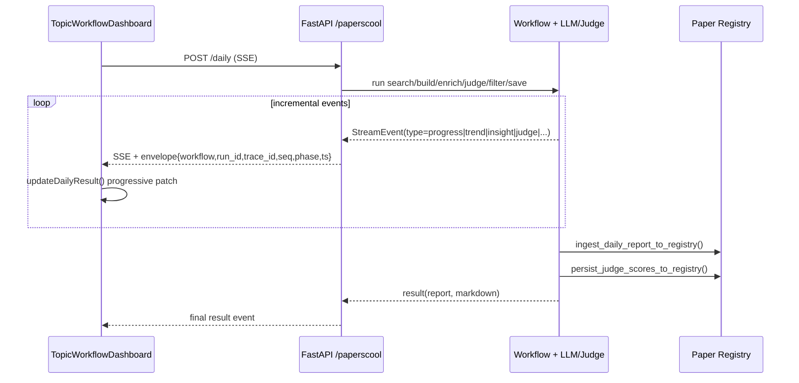

# PaperBot Workflow — Overall Flow & Design Principles

This doc summarizes the current end-to-end workflow for Topic Search -> DailyPaper -> Analyze (Judge/Trends/Insight), plus the runtime principles behind the implementation.

## 1) End-to-End Pipeline (DAG View)

```mermaid
flowchart LR
    U[User: TopicWorkflowDashboard] --> S1[POST /api/research/paperscool/search]
    U --> S2[POST /api/research/paperscool/daily (SSE)]
    U --> S3[POST /api/research/paperscool/analyze (SSE)]

    subgraph Search Workflow
      A1[Normalize Queries]\n(alias + tokenize)
      A2[Multi-source Collect]\n(papers_cool + arxiv_api + hf_daily)
      A3[Deduplicate + Merge]\n(by URL/title)
      A4[Score + Rank]
      A5[Query Views + Summary]
    end

    S1 --> A1 --> A2 --> A3 --> A4 --> A5

    subgraph DailyPaper SSE
      D1[search_done]
      D2[report_built]\n(top_n per query/global)
      D3[llm_summary/trend/insight]
      D4[judge events]\n(candidate select + scoring)
      D5[filter_done]\n(keep must_read/worth_reading)
      D6[save + notify]
      D7[result]\n(report + markdown + paths)
    end

    S2 --> D1 --> D2 --> D3 --> D4 --> D5 --> D6 --> D7

    subgraph Analyze SSE (incremental)
      Z1[trend] --> Z2[UI patch llm_analysis.query_trends]
      Z3[insight] --> Z4[UI patch llm_analysis.daily_insight]
      Z5[judge] --> Z6[UI patch per-paper judge]
      Z7[judge_done/result] --> Z8[final consistency overwrite]
    end

    S3 --> Z1
    S3 --> Z3
    S3 --> Z5
    S3 --> Z7

    D7 --> P1[(Paper Registry)]
    Z8 --> P1
```

## 2) Realtime Streaming Contract (UI/Backend)



## 3) Core Principles

1. **Data-driven UI state**
   - DAG/tab rendering is derived from persisted report content (`dailyResult`), not just transient checkbox/phase state.
   - Page refresh should still reconstruct historical state from persisted data.

2. **Progressive rendering over SSE**
   - `trend`, `insight`, and `judge` events patch store incrementally so users see cards/scores as they arrive.
   - `result` event still performs final overwrite for consistency.

3. **Separation of concerns**
   - Search pipeline handles source collection + dedupe + ranking.
   - Daily/Analyze focus on enrichment, judge scoring, filtering, persistence, notification.

4. **Budget-aware judge selection**
   - Judge candidates are selected by `max_items_per_query` and optional `token_budget`.
   - Scoring is rank-first, then budget constraint applied.

5. **Contract-first runtime**
   - Agent lifecycle follows unified model: `input -> plan -> execute -> emit events -> finalize`.
   - Streaming envelope carries traceability fields (`run_id`, `trace_id`, `seq`, `phase`, `ts`).

## 4) Why You Often See 15 Judged Papers

A common case is:
- `judge_max_items_per_query = 5`
- active queries = 3
- token budget not limiting

Then candidate count is usually `3 * 5 = 15`.

After judge, Daily path applies filter policy:
- keep only `must_read` and `worth_reading`
- remove `skim` and `skip`

So the final displayed paper count can be lower than candidate count.

## 5) How to Import This into Draw.io

You can paste either Mermaid block into Draw.io:
1. Open `https://app.diagrams.net/`
2. `Insert` -> `Advanced` -> `Mermaid`
3. Paste code block and apply

